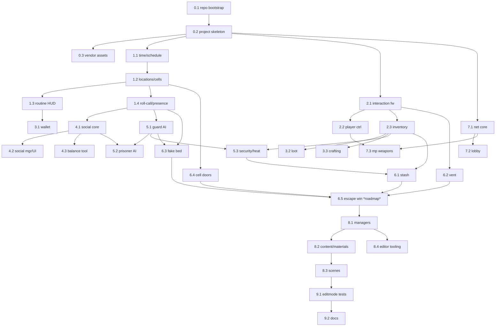

# Prison Escape — Version-Control & PR Seeding Plan

> **Purpose.** The whole game already exists on disk as one big working tree with **no git history**. This plan reconstructs an *idealized build order* so the codebase is introduced as a sequence of small, reviewable, feature-scoped **Pull Requests**. The result is a git history that reads like a story: "here is how time/scheduling was added, then locations, then the player, then crafting, then AI, then the escape mechanics…" — with logs, diffs, and PR descriptions explaining *why* each system entered the codebase.

---

## 0. Current repo state (starting point)

- Branch: `main` (no commits yet — index is currently staged but **not committed**).
- Tooling: git 2.51, **git-lfs 3.7.0** installed and initialized.
- LFS already configured via `.gitattributes` → **439 binaries** (models, textures, audio, fonts, native libs) route to LFS.
- `.gitignore` already ignores `Library/`, `Temp/`, `Logs/`, `UserSettings/`, IDE files, builds.
- **2,184** files would otherwise land in a single giant commit. We will instead split them.

### Repo hygiene to resolve before/within PR-0
| Item | Path | Action |
|---|---|---|
| Nested duplicate project | `3dgame/` (23 files: `ProjectSettings/*`, `Packages/*`) | **Remove** — accidental nested copy of the project skeleton. |
| Plastic SCM leftovers | `.plastic/`, `ignore.conf` | **Remove + gitignore** (we're on git now). |
| Top-level `node_modules/` | `node_modules/` | **gitignore** (not currently tracked — keep it that way). |
| Script text dumps | `CodebaseExport/*.txt` | **gitignore** (regenerable export, not source of truth). |
| Recovery autosaves | `Assets/_Recovery/*.unity` | Decide: keep (history) or remove. Default: **remove** (8 stale autosave scenes). |
| AI-generated asset cache | `GeneratedAssets/` (210 files) | Keep, but isolate into its own vendor-style PR (see PR-0.3). |

---

## 1. Strategy & conventions

### 1.1 Stacking model
Because every file already exists and Unity compiles **all** of `Assembly-CSharp` together, we use **stacked PRs in dependency order**: each PR branches off the previous one, adding only its slice. Foundations land first, consumers later.

```
main
 └─ pr/00-bootstrap         (repo + project skeleton)
     └─ pr/01-...           (core sim)
         └─ pr/02-...       (player/interaction)
             └─ ...         (each builds on the last)
```

> **Compile-at-each-step caveat.** A few leaf PRs (e.g. a UI widget that calls a manager) only fully compile once both halves are present. We order by dependency to minimize this, and group tightly-coupled scripts together. CI runs a Unity compile/test gate on the **tip** of each stack; intermediate commits prioritize *clean, readable diffs* over standalone compilation. (Alternative "strict compile-clean" mode in §6.)

### 1.2 The `.meta` rule
Every Unity asset/script ships with its `.meta` sibling. **A file and its `.meta` always travel in the same PR.** Scenes/prefabs reference scripts by the GUID stored in the `.meta`, so never split them.

### 1.3 Branch naming
`pr/<epic><seq>-<kebab-feature>` — e.g. `pr/01a-time-schedule-core`, `pr/05a-guard-ai`.

### 1.4 Commit message format (Conventional Commits)
```
<type>(<scope>): <summary>

<why this change exists / what it introduces>
<notable design decisions, dependencies, follow-ups>
```
`type` ∈ `feat | fix | refactor | test | docs | chore | build | perf`.
`scope` ∈ `prison | schedule | social | crafting | inventory | ai | escape | mp | ui | tests | repo`.

### 1.5 PR description template
```
## What
One-paragraph summary of the feature this PR introduces.

## Why
The gameplay/architecture motivation (link to docs/Game_Features_And_Test_Coverage.md).

## Scope (files)
- Assets/Scripts/.../Foo.cs (+ .meta)

## Depends on
#<previous PR>

## Tests
EditMode: <suite> (or "none yet — see roadmap")

## Notes / follow-ups
```

### 1.6 Labels (suggested)
`epic:core-sim`, `epic:player`, `epic:economy`, `epic:social`, `epic:ai`, `epic:escape`, `epic:multiplayer`, `epic:content`, `epic:tests`, `epic:repo`, plus `lfs` for asset-heavy PRs.

---

## 2. The PR map

Legend: **🧩 scripts** · **🎨 assets** · **🧪 tests** · **📄 docs**. "Depends" = stacked base.

### EPIC 0 — Bootstrap & scaffolding
| PR | Title | Scope | Depends |
|---|---|---|---|
| **0.1** | `build(repo): bootstrap git, LFS, gitignore, README` | `.gitignore`, `.gitattributes`, `docs/`, root `README.md`; remove nested `3dgame/`, `.plastic/`, `ignore.conf`; ignore `node_modules/`, `CodebaseExport/` | — (root commit on `main`) |
| **0.2** | `build(repo): Unity project skeleton (URP)` | `ProjectSettings/**`, `Packages/manifest.json`, `Packages/packages-lock.json`, `Assets/Settings/**` (URP), `Assets/InputSystem_Actions.inputactions`, `*.slnx`, `steam_appid.txt` | 0.1 |
| **0.3** | `chore(content): vendor third-party assets` 🎨LFS | `Assets/TextMesh Pro/**`, `Assets/UnityTechnologies/**`, `Assets/Low Poly Guns/**`, `Assets/AI Toolkit/**`, `GeneratedAssets/**` | 0.2 |

### EPIC 1 — Core prison simulation
| PR | Title | Key scripts | Depends |
|---|---|---|---|
| **1.1** | `feat(schedule): time + daily routine engine` | `PrisonTimeManager`, `PrisonSchedule`, `PrisonEventType`, `PrisonEventRules`, `PrisonEventExtensions`, `PrisonRoutineLabels` | 0.2 |
| **1.2** | `feat(prison): locations, zones, cell data` | `PrisonLocationRegistry`, `PrisonLocationZone`, `CellData`, `PrisonNavMeshValidator` | 1.1 |
| **1.3** | `feat(ui): routine/compliance HUD` | `DailyRoutineBarUI`, `RoutineNowNextBarUI`, `RoutineBarDisplayController`, `RoutineBarTimerReadability`, `MinimalSchedulePhaseTextHUD`, `TextRoutineComplianceHUD`, `ComplianceStatusHUD`, `PrisonScheduleUI`, `PrisonUITheme` | 1.2 |
| **1.4** | `feat(prison): roll-call & presence` | `MorningRollCallTracker`, `PrisonerPresence`, `IPrisoner` | 1.2 |

### EPIC 2 — Player & interaction
| PR | Title | Key scripts | Depends |
|---|---|---|---|
| **2.1** | `feat(interaction): interaction framework` | `IInteractable`, `PlayerInteractor`, `InteractionReticleView`, `WorldItemPickup` | 0.2 |
| **2.2** | `feat(player): inmate controller + camera` | `PrisonerController`, `Multiplayer/Player/CameraController` (shared cam) | 2.1 |
| **2.3** | `feat(inventory): item data + inventory UI` | `ItemData`, `ItemType`, `ToolData`, `WeaponData`, `PartData`, `ItemDatabase`, `PlayerInventory`, `InventoryUI`, `InventorySlotUI`, `HotbarUI`, `ItemTooltipUI`, `HeldItemDisplay`, `PickupItem` | 2.1 |

### EPIC 3 — Economy & crafting
| PR | Title | Key scripts | Depends |
|---|---|---|---|
| **3.1** | `feat(economy): player wallet + cash UI` | `PlayerWallet`, `CashUIController` | 1.3 |
| **3.2** | `feat(loot): loot tables, spawners, containers` | `LootTable`, `ItemSpawnNode`, `ContrabandSpawner`, `WorldContainer` | 2.3 |
| **3.3** | `feat(crafting): crafting system + notebook UI` | `CraftingRecipe`, `CraftingSystem`, `CraftingRecipeDescription`, `RecipeRequirementSlotUI`, `NotebookRecipeIndexEntry`, `StolenNotebookUI` | 2.3 |

### EPIC 4 — Social & reputation
| PR | Title | Key scripts | Depends |
|---|---|---|---|
| **4.1** | `feat(social): affinity/reputation math core` | `SocialMath`, `ReputationTier`, `SocialActionType`, `NPCPersonalityData`, `FavorOfferDefinition` | 1.4 |
| **4.2** | `feat(social): manager + presentation UI` | `SocialManager`, `PrisonerSocialPresenter`, `PrisonSocialRowUI`, `AffinityFloatPopup`, `CameraBillboard`, `CanvasGroupFader` | 4.1 |
| **4.3** | `feat(tools): social balance simulator (editor)` | `Editor/SocialBalanceSimulatorWindow` | 4.1 |

### EPIC 5 — AI
| PR | Title | Key scripts | Depends |
|---|---|---|---|
| **5.1** | `feat(ai): guard FSM, detection, shifts` | `GuardFSM`, `GuardDetection`, `GuardShiftController` | 1.4 |
| **5.2** | `feat(ai): prisoner routine AI` | `PrisonerAI` | 4.1, 5.1 |
| **5.3** | `feat(security): alerts, shakedown, heat` | `PrisonSecurityAlerts`, `MorningShakedownSweeper`, `PrisonHeatUI` | 5.1, 2.3 |

### EPIC 6 — Escape mechanics (the main goal 🔑)
| PR | Title | Key scripts | Depends |
|---|---|---|---|
| **6.1** | `feat(escape): contraband concealment` | `PillowStash`, `PillowStashProximityUI` | 2.3, 5.3 |
| **6.2** | `feat(escape): vent route (unscrew → open)` | `VentCover`, `InteractableScrew` | 2.1, 2.3 |
| **6.3** | `feat(escape): fake-bed night-check defeat` | `CellBed`, `FakeBedDummy` | 1.4, 5.1 |
| **6.4** | `feat(escape): custom barred cell doors` | `CellDoorController` | 1.2 |
| **6.5** | `feat(escape): completion/win system` *(NOT BUILT — roadmap)* | `EscapeZone`, `EscapeManager`, win event | 6.1–6.4 |

### EPIC 7 — Multiplayer FPS layer
| PR | Title | Key scripts | Depends |
|---|---|---|---|
| **7.1** | `feat(mp): networking core` | `NetworkManager`, `GameClient`, `FindGame` | 0.2 |
| **7.2** | `feat(mp): lobby` | `LobbyManager`, `ClientLobbyHandlers` | 7.1 |
| **7.3** | `feat(mp): player, weapons, recoil` | `Player`, `PlayerController`, `PlayerInventory` (MP), `Weapons/Gun`, `WeaponController`, `WeaponSway`, `RecoilController` | 7.1, 2.2 |

### EPIC 8 — Bootstrapping & built content
| PR | Title | Scope | Depends |
|---|---|---|---|
| **8.1** | `feat(game): managers & launchers` | `GameManager`, `SinglePlayerLauncher` | most of 1–6 |
| **8.2** | `feat(content): prison materials & accents` 🎨 | `Assets/Materials/**` (incl. `Prison/Accents/**`), `Assets/ScriptableObjects/**`, `Assets/Prefabs/**`, `Assets/Resources/**`, `Assets/Sprites/**`, `Assets/Sound Effects/**`, `Assets/Models/**`, `Assets/Maps/**`, `Assets/Level/**` | 8.1 |
| **8.3** | `feat(content): scenes` 🎨 | `Assets/Scenes/*.unity` (MainMenu, Game, PrisonLevel1, SinglePlayerScene, Factory, Warehouse, Warmup) | 8.1, 8.2 |
| **8.4** | `chore(editor): build/overhaul tooling` | `Assets/Editor/PrisonOverhaulRunner.cs`, other editor scripts | 8.1 |

### EPIC 9 — Tests & documentation
| PR | Title | Scope | Depends |
|---|---|---|---|
| **9.1** | `test(editmode): door/social/rules/crafting suites` 🧪 | `Assets/Tests/Editor/*` (CellDoorController, SocialMath, PrisonRulesAndLabels, CraftingInventoryLoot) | all referenced systems |
| **9.2** | `docs: feature & test-coverage reference` 📄 | `Assets/Docs/**`, `docs/PR_PLAN.md` | — |

---

## 3. Dependency graph



---

## 4. `.gitignore` additions for PR-0.1
```
# Node tooling
node_modules/

# Plastic SCM leftovers
.plastic/
ignore.conf

# Regenerable codebase export
CodebaseExport/
```

---

## 5. Execution mechanics (when approved)

Because there is **no initial commit yet**, we seed deliberately rather than `git add -A`:

1. **Clear the index** (keeps the working tree intact, no files deleted):
   ```bash
   git rm -r --cached . >/dev/null
   ```
2. **PR-0.1 (root commit on `main`):** delete nested `3dgame/`, `.plastic/`, `ignore.conf`; add ignore rules; then stage *named paths only*:
   ```bash
   git add .gitignore .gitattributes README.md docs/
   git commit -m "build(repo): bootstrap git, LFS, gitignore"
   ```
3. **Each subsequent PR:** branch off the previous tip, stage **only that slice's named files (+ their `.meta`)**, commit with the conventional message, push, open PR:
   ```bash
   git switch -c pr/01a-time-schedule-core
   git add Assets/Scripts/Shared/Prison/PrisonTimeManager.cs* \
           Assets/Scripts/Shared/Prison/PrisonSchedule.cs* \
           Assets/Scripts/Shared/Prison/PrisonEvent*.cs* \
           Assets/Scripts/Shared/Prison/PrisonRoutineLabels.cs*
   git commit -m "feat(schedule): time + daily routine engine"
   git push -u origin pr/01a-time-schedule-core
   gh pr create --base main --fill
   ```
4. Repeat down the stack. The final merge of the stack reconstitutes the full project on `main`.

> **Safety:** no destructive history rewrites; `git rm --cached` only unstages (working tree files stay). A backup ref is created before any index surgery.

---

## 6. Sequencing options

- **Option A — Full narrative stack (recommended, ~30 PRs).** Everything above. Richest history; best "how it was introduced" story. A few intermediate commits won't standalone-compile (documented), CI gates the tip.
- **Option B — Strict compile-clean (fewer, larger PRs ~10–12).** Merge tightly-coupled epics so every PR compiles independently (e.g. collapse 1.1–1.4 into "core sim", 2.x into "player+inventory"). Less granular logs, but every commit builds.
- **Option C — Baseline + forward-only.** One `chore: import existing project` commit, then this PR discipline applies to *new* work going forward. Fastest; least historical detail. (Not what you asked for, listed for completeness.)

**Recommendation:** Option A, with epics 0/8/9 kept as the natural "scaffold → wire-up → verify" bookends.

---

## 7. Future / follow-up PRs (post-seeding)
- **6.5 Escape completion system** — the missing keystone (see `Game_Features_And_Test_Coverage.md` §1.1).
- **`test`** — extract pure seams (Tier 2) + PlayMode tests (requires `.asmdef` migration).
- **`build(ci)`** — GitHub Actions: Unity compile + EditMode test gate on each PR; LFS-aware checkout.
- **`chore(asmdef)`** — assembly-definition split (`Prison.Runtime`, `Prison.Editor`, `Prison.Tests`) to speed compiles and unlock PlayMode tests.
```

---

## 8. Open decisions for you
1. **Sequencing option** — A (granular, recommended), B (compile-clean), or C (baseline)?
2. **`Assets/_Recovery/` autosaves** — keep for history or delete?
3. **GitHub** — still want me to install `gh`, create the public `prison-escape` repo, and push the stack once approved?
