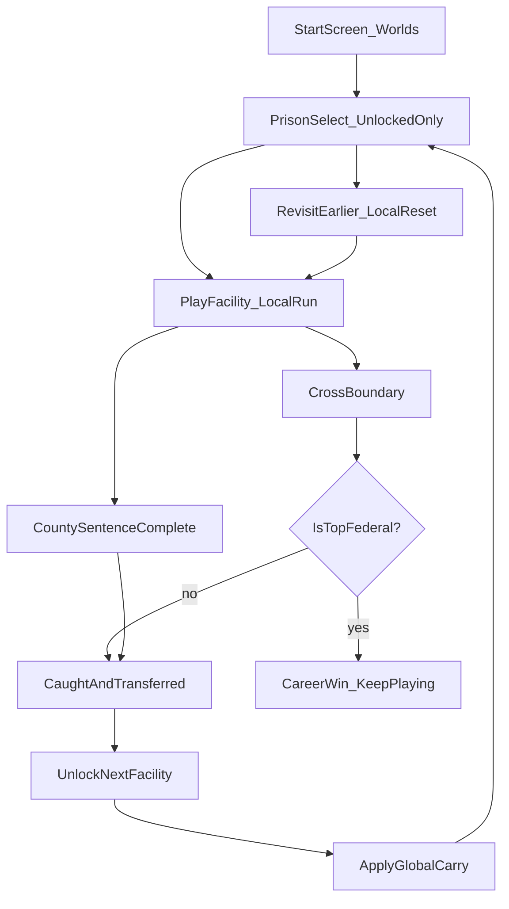

# Prison Career Ladder

**Status:** Implemented (M1–M5 first code ship) — 7/15/2026. Design doc approved same day; all five code milestones landed together (world saves + store, start screen + prison select, facility definitions, transfer/graduation, County sentence clock) with EditMode coverage. Facility geometry beyond the County stub remains the M6+ content track.
**Feature specs:** [[World Saves & Start Screen]] · [[Facility Transfer & Graduation]]
**Branch:** `feat/career-ladder-design` (docs) → `feat/career-world-saves` (M1) and onward
**Code:** `Assets/Scripts/Shared/Career/` (model, store, session, transfer flow, hub UI) · `Assets/Tests/Editor/CareerWorldStoreTests.cs` + `CareerTransferTests.cs` · facility SO assets in `Assets/Resources/Facilities/`
**Supersedes:** the Min → Medium → High → Supermax ladder in [[Game Vision & Core Loop]] and the "YOU ESCAPED = free" framing in [[Escape Completion System]].

This is the **primary design doc** for the game's career-spanning progression: one County jail, three State prisons, five Federal prisons, plus a Dev sandbox. Escape never means freedom until the very top — it means you got **caught outside the wall and sentenced to somewhere worse**. That *is* the career.

---

## The fantasy

You are a career escape artist. Every facility is a puzzle box; solving it doesn't set you free — it graduates you to a harder box. Money, reputation, gang ties, and hard-won skills follow you up the ladder; tools, contraband, and local friendships do not. The question the game asks at every tier: **leave now, or stay and get stronger first?**

### Pillar addition (goes in [[Game Vision & Core Loop]])

> **Time investment is strategy.** Easier facilities have better money/loot/favor rates; harder facilities demand more cash, favors, and power to open routes. Leaving early is always possible — and punishing later.

## Locked design decisions

These were decided in chat 7/15/2026 and are final unless overridden here:

1. **Escape = transfer, not freedom.** Crossing the boundary means you get **caught** and are **sentenced to the next harder facility**. Narrative win at the top Federal facility; never literal freedom before that.
2. **County also allows waiting out a sentence:** serve the full sentence (default **7 in-game days**) → graduate to State Minimum without escaping. County is the only facility with this option.
3. **The ladder is linear and strictly increasing in difficulty:** County → State ×3 → Federal ×5.
4. **The current Minimum Security prison is the Dev / Sandbox facility** — layout/tooling/playtest prison, *not* on the career path.
5. **Worlds = multiple named career saves**, each with its own progression; resume by name.
6. **Prison select shows all facilities; only unlocked ones are enterable.** Locked = **black silhouette** placeholder, no lore spoilers.
7. **Revisiting an unlocked prison starts the local run from scratch**, but **global saveables persist** — farming easier prisons is a valid power strategy.
8. **Escaping the top Federal facility = technical game win.** The world stays playable; revisit anywhere for more power.

---

## Facility catalog (canonical IDs)

IDs are permanent (save-file keys); display titles are **placeholders** until renamed in this note.

### Dev (not on the career path)

| ID | Title (placeholder) | Role |
|---|---|---|
| `dev_sandbox` | Development Prison | The current Minimum-Security layout ([[Prison Layout — Minimum Security]]). Tooling & playtest. Visible in development builds; hidden in release unless unlocked by cheat. |

### Career ladder (index 0 → 8)

Every facility is its own Unity scene — `MainMenu` is the hub scene; entering a facility loads its scene, and transfer/quit returns to the hub. `CountyJail` exists today as a stub (a copy of the dev layout that can now diverge); the rest show UNDER CONSTRUCTION on the select screen until their scene lands in Build Settings.

| Index | System | Security | Placeholder title | Scene (when built) |
|---|---|---|---|---|
| 0 | County | — | County Detention Center | `CountyJail` (stub shipped 7/15) |
| 1 | State | Minimum | State — Minimum | `StateMin` |
| 2 | State | Medium | State — Medium | `StateMed` |
| 3 | State | Maximum | State — Maximum | `StateMax` |
| 4 | Federal | Camp | Federal Camp | `FedCamp` |
| 5 | Federal | Low | Federal Low | `FedLow` |
| 6 | Federal | Medium | Federal Medium | `FedMed` |
| 7 | Federal | High | Federal High | `FedHigh` |
| 8 | Federal | ADX | Federal Administrative Max | `FedAdx` |

**MVP scope for the first code ship:** catalog + UI + save/transfer plumbing for **all 9 slots**; playable geometry is Dev Sandbox + a County stub/greybox first. Building all 9 layouts is a multi-epic content track (see milestones) — the design defines all of them now, and each unlocks for real play as its scene exists.

---

## Core fantasy loop (updated)



Inside a facility, the existing core loop is unchanged — routine mastery, acquisition, crafting, defeating checks ([[Game Vision & Core Loop]]). This ladder wraps it.

---

## Transfer & graduation rules

Full mechanics in [[Facility Transfer & Graduation]]; the laws:

1. **Crossing the outer boundary** of facility *N* → transfer ceremony ("CAUGHT — TRANSFERRED"), unlock facility *N+1*, apply global carry, return to Prison Select (with an "enter now" shortcut).
2. **County sentence clock:** surviving `sentenceDays` (default 7) in County without escaping → "SENTENCE COMPLETE" ceremony → same unlock/carry flow. Framing differs (you *earned* min security); mechanics identical.
3. **Escaping `FedAdx`** → "CAREER CLEARED" ceremony + win flag. The world stays fully playable.
4. **Transfer confiscates all inventory** — carried slots *and* pillow stash. You arrive with nothing local. (Default; a tiny "smuggle slot" is a possible later perk — see open questions.)
5. **Getting caught escaping** (spotted in a restricted zone) is unchanged: solitary, stat hits, suspicion ([[Escape Completion System]]). Only *succeeding* — crossing the boundary — triggers transfer.
6. **Revisit:** entering any unlocked facility (including moving back down the ladder) starts a **fresh local run** — Day 1, fresh seed, fresh NPC population memory, re-rolled cell, all routes re-closed. Global carry applies on entry.

**"From scratch" means the facility run state, never the career.**

---

## Global vs local persistence

The single most important table in this design. When in doubt: *power and identity are global; physical situation is local.*

### Global — the career world (survives transfer and revisit)

| Saveable | Notes |
|---|---|
| **Cash** | `PlayerWallet` balance (+ dirty-money flag when [[Loot & Economy]] adds it) |
| **Career Respect** | Single 0–100 career score; seeds how each new prison's population treats you on arrival. Bridges into [[Social Ecosystem & Gangs]] when it lands. |
| **Gang affiliation** | Gang id + rank tier. Local chapters re-seed per facility but remember your flag. |
| **Stats** | Mental Health / Physical Health / Strength **current values** carry (default: keep) |
| **Recipes known** | Persist globally (default) |
| **Unlocks** | `unlockedFacilityIds[]`, career-win flag |
| **Career stats** | Total days lived, total transfers, per-facility visit log |
| **World metadata** | Name, created/last-played timestamps, current facility |

### Local — reset on every facility entry, including revisits

| Run state | Reset behavior |
|---|---|
| Inventory + pillow stash | Empty on arrival (confiscated at transfer) |
| Heat / suspicion / solitary state | Cleared |
| Schedule day index | Day 1 |
| World loot layout | New seed per visit: `hash(worldId, facilityId, visitIndex)` |
| Per-NPC relationships & memory | Fresh population (career Respect sets the *starting band*, not individual affinities) |
| Opened doors, cut fences, unscrewed vents, placed tools | All restored/closed |
| Cell assignment | Re-rolled |

Career Respect → arrival treatment (tunable): Respect < 25 → NPCs start at baseline; 25–50 → small positive affinity seed (+10); 50–75 → +20 and gang chapters offer membership faster; 75+ → +30, guards' shakedowns of *you* prioritized (fame cuts both ways — flagged tunable).

---

## Difficulty & pacing curves

Each facility gets a `FacilityDefinition` ScriptableObject holding the fields below. Numbers are **design targets, all tunable in the SO** — the *shape* of each curve is the contract.

| # | Facility | `lootAbundance` | `cashIncomeMult` | `tradePriceMult` | `bribeCostMult` | `escapeRouteCostMult` | `detectionRangeMult` | `shakedownStrictness` | `recommendedStayDays` |
|---|---|---|---|---|---|---|---|---|---|
| 0 | County | 1.30 | 1.00 | 0.90 | 1.00 | 1.00 | 0.90 | 0.75 | 3–7 |
| 1 | State Min | 1.15 | 1.20 | 1.00 | 1.20 | 1.20 | 1.00 | 0.90 | 5–8 |
| 2 | State Med | 1.00 | 1.35 | 1.15 | 1.45 | 1.45 | 1.10 | 1.00 | 6–10 |
| 3 | State Max | 0.90 | 1.50 | 1.30 | 1.75 | 1.75 | 1.20 | 1.15 | 8–12 |
| 4 | Fed Camp | 0.85 | 1.70 | 1.45 | 2.10 | 2.10 | 1.25 | 1.20 | 8–12 |
| 5 | Fed Low | 0.75 | 1.90 | 1.65 | 2.50 | 2.55 | 1.30 | 1.30 | 10–14 |
| 6 | Fed Med | 0.65 | 2.15 | 1.90 | 3.00 | 3.10 | 1.35 | 1.40 | 12–16 |
| 7 | Fed High | 0.55 | 2.40 | 2.20 | 3.60 | 3.80 | 1.45 | 1.55 | 14–18 |
| 8 | Fed ADX | 0.45 | 2.70 | 2.60 | 4.50 | 4.60 | 1.55 | 1.75 | 16–22 |

**Reading the curves:**

- **`lootAbundance`** falls: County is littered with parts; ADX is bare. Multiplies loot spawn density in `PrisonLootSetupRunner` output.
- **`cashIncomeMult`** rises: harder prisons pay better (work wages, favor payouts) — surviving there is itself lucrative, so *staying* at your ceiling is rewarded too. But **`tradePriceMult`** rises faster than income after State Med: the *net* economy still favors farming low tiers for raw cash, matching decision 7.
- **`bribeCostMult` / `escapeRouteCostMult`** rise steepest — these are the sinks that make "arrive broke at Fed High" a trap. Route costs cover tool recipes' part counts, cash sinks (buying a keycard copy), and favor-standing gates.
- **`detectionRangeMult`** multiplies the base 10 m guard cone ([[Guard AI]]); ADX guards see 15.5 m. Suspicion's ×1.4 stacks on top.
- **`shakedownStrictness`** scales morning-sweep thoroughness ([[Roll Call & Shakedown]]): below 1.0 sometimes skips cells; above 1.0 adds re-checks and (later, with Social v2) targeted shakedowns.
- **`recommendedStayDays`** is **soft guidance** shown on the prison-select card and the notebook — never a hard lock.

### Soft transfer gates (`transferThreshold`)

Optional per-facility gates on **attempting the boundary** — *not* on unlocking or entering the slot. Defaults:

| Facility | Gate to attempt escape |
|---|---|
| County → State Max | none |
| Fed Camp, Fed Low | none |
| Fed Med | $2,500 **or** Respect ≥ 40 |
| Fed High | $5,000 **or** Respect ≥ 60 |
| Fed ADX | $10,000 **and** Respect ≥ 75 |

Rationale: the last three tiers are where an under-powered player would soft-lock into a facility they can't afford to solve; the gate converts "you will grind miserably here" into an explicit, readable goal. Gates are expressed in-fiction (the route's fixer demands payment / the gang won't back an unknown). All values tunable; gates can be disabled per-SO.

### County sentence clock

- Default **7 in-game days** (= 7 × 24 real minutes ≈ 2.8 h play) without escaping → auto-transfer to State Min at the next Morning Count.
- HUD: County shows a "Days served: N / 7" line in the routine bar area ([[Routine & Schedule HUD]]).
- Escaping before day 7 also transfers (caught framing) — faster, but you skip County's easy farming. First real "leave now or get stronger?" decision of the game.

---

## Economy scaling & the farming strategy

The intended dominant strategies, in the designers' words:

- **Speedrun the ladder:** escape each tier ASAP. Viable but brutal from Fed Med up — you arrive broke into rising costs and soft gates.
- **Farm-and-climb (intended default):** stay near `recommendedStayDays`, bank cash/respect, then move. The County sentence clock teaches this rhythm on tier 0.
- **Yo-yo farming:** climb to your wall, revisit County/State Min for fast safe cash (high `lootAbundance`, low detection), return. Cost: real time (each revisit is a from-scratch run — travel + re-setup overhead is the tax). This is *allowed and intended* (decision 7), tuned to be worth it but slower than playing well at tier.

Anti-degenerate levers if yo-yo farming proves too dominant during tuning: diminishing `lootAbundance` per revisit within the same world (`0.9^(visitIndex-1)` floor 0.6 — **off by default**), and flat per-run setup time (already inherent: Day-1 start, no tools).

---

## Career Respect (bridge to Social v2)

Until [[Social Ecosystem & Gangs]] lands, Career Respect is a simple counter the transfer system owns:

| Event | Δ Respect |
|---|---|
| Escape a facility | +8 + 2×tier |
| Serve out County sentence | +5 |
| Each full day survived at tier ≥ 4 | +0.5 |
| Caught escaping (solitary) | −2 |

Clamped 0–100. When Social v2 ships, this becomes the seed/output of its Respect axis rather than a separate number — the save field is shared (`global.respect`).

**Gang affiliation** is stored globally from day one (id + rank tier) even though gangs arrive with Social v2 — the save schema shouldn't migrate later. Default: affiliation chosen once (in whichever facility you first join), persists up the ladder; switching costs are Social v2's problem (open question 2).

---

## Start screen & worlds UX (summary)

Full spec: [[World Saves & Start Screen]]. The stock `MainMenu` scene (already loaded by `EscapeEndScreenUI`) becomes this hub, styled per [[UI Theme & Style Guide]] (`PrisonUITheme` — dark institutional chrome, caution yellow accents, not a generic game menu).

```
┌──────────────────────────────────────────────┐
│              P R I S O N   E S C A P E       │
│                                              │
│   ▶ CONTINUE      "Lifer" — Fed Low, Day 3   │
│     NEW WORLD                                │
│     LOAD WORLDS                              │
│     QUIT                                     │
└──────────────────────────────────────────────┘
```

- **New World:** name prompt → create `CareerWorld` → everything locked but County (+ Dev in dev builds) → Prison Select.
- **Load Worlds:** named list w/ last-played facility, day, cash, respect; delete with confirm.
- **Prison Select (hub):** grid of all 9 career facilities (+ Dev). Unlocked: icon, title, short description, recommended-stay hint, "ENTER". Locked: **black silhouette**, greyed title only, no description. Current facility highlighted.
- Enter → load facility scene → apply global carry → fresh local run.

---

## Data model

Persistence: **JSON** under `Application.persistentDataPath/worlds/{id}.json` — one file per world, human-readable, EditMode-testable. No PlayerPrefs blobs. `schemaVersion` int from day one; loader migrates forward.

```
CareerWorld
  schemaVersion : int
  id            : string (guid)
  displayName   : string
  createdUtc, lastPlayedUtc
  currentFacilityId : string
  global:
    cash            : int
    respect         : float (0–100)
    gangId          : string?   gangRank : int
    mentalHealth, physicalHealth, strength : int (0–100)
    unlockedFacilityIds : string[]
    recipesKnown    : string[]
    careerWon       : bool
    totalDaysLived, totalTransfers : int
  visitLog[]:
    facilityId, visitIndex, daysSpent, escaped : bool, endedUtc

FacilityDefinition (ScriptableObject — 10 assets)
  id, system, securityTier (0–8), title, description
  icon, silhouette : Sprite
  sceneName : string ("" = not built yet → slot shows silhouette even if unlocked, with "UNDER CONSTRUCTION")
  lootAbundance, cashIncomeMult, tradePriceMult, bribeCostMult,
  escapeRouteCostMult, detectionRangeMult, shakedownStrictness : float
  recommendedStayDaysMin/Max : int
  sentenceDays : int? (County = 7; null elsewhere)
  transferThresholdCash : int?  transferThresholdRespect : float?  (soft gates)

FacilityRunState (serialized per visit inside the world file; overwritten on re-entry)
  facilityId, visitIndex, day, worldSeed
  inventory, stash, heat/suspicion, npcRelationshipBlob, cellAssignment
```

- `GameManager.worldSeed` becomes the **per-run facility seed**: `hash(world.id, facilityId, visitIndex)` — deterministic per visit, fresh per revisit (satisfies [[World Rules]] rule 17 within a run).
- A facility whose `sceneName` is empty can still be *unlocked* by the ladder — the select screen shows it as buildable-later ("under construction" silhouette variant) and auto-skips it as an entry target until a scene exists. This keeps save data honest while content catches up.

---

## Implementation milestones

| Phase | Branch | Deliverable | Status |
|---|---|---|---|
| **D0** | `feat/career-ladder-design` | These vault docs — merge on approval | ✅ 7/15 |
| **M1** | `feat/career-world-saves` | `CareerWorld` model, JSON IO + migration, EditMode tests, New/Load/Delete world API | ✅ 7/15 — `CareerWorldStore`, 12 tests |
| **M2** | `feat/start-screen-prison-select` | MainMenu rebuild: worlds list + prison select + silhouettes; enter Dev + County stub | ✅ 7/15 — `CareerMainMenuUI` (runtime-built over MainMenu scene) |
| **M3** | `feat/facility-definitions` | 9+1 `FacilityDefinition` SOs; multiplier hooks into wallet/loot/detection/shakedown (even while only Dev's scene exists) | ✅ 7/15 — SOs in `Resources/Facilities`; loot/detection/shakedown/arrival-affinity hooks live, economy multipliers exposed for [[Loot & Economy]] |
| **M4** | `feat/transfer-graduation` | Boundary/sentence → ceremony → unlock next → global carry → local reset; end-screen rewrite | ✅ 7/15 — `CareerTransferFlow` + `EscapeEndScreenUI` ceremony rebuild, 19 tests |
| **M5** | `feat/county-sentence-clock` | County day counter, HUD line, auto-transfer | ✅ 7/15 — `CareerRunBootstrap` day tick + `SentenceClockHUD` |
| **M6+** | content epics | County → State ×3 → Federal ×5 scenes, each unlocking real play | County stub shipped as its own `CountyJail` scene (copy of the dev layout, free to diverge); State/Federal scenes pending |

**Out of scope for the first code ship:** geometry for all 9 facilities; multiplayer career; cloud saves.

## Systems touched

[[Escape Completion System]] / [[Escape Routes & Mechanics]] (keystone rewrite) · [[Loot & Economy]] / `PlayerWallet` (global cash, multipliers) · [[Social Ecosystem & Gangs]] (respect + gang go global) · [[Screens & Menus]] (MainMenu becomes the hub) · [[World Rules]] + [[Game Vision & Core Loop]] (ladder rewrite) · [[Time & Schedule]] (sentence clock day tick) · [[Guard AI]] / [[Roll Call & Shakedown]] (difficulty multipliers) · [[UI Theme & Style Guide]]

## Defaults locked so we can ship without more questions

| Topic | Default |
|---|---|
| Facility display names | Placeholders above (rename here later) |
| County sentence | 7 in-game days |
| Locked UI | Black silhouette; no lore spoilers |
| Recipes on revisit | Persist globally |
| Inventory on transfer/revisit | Cleared — confiscated at transfer (stash included) |
| Stats on transfer | Current values carry |
| Dev prison on start screen | Visible in development builds; hidden in release unless unlocked by cheat |
| Dev sandbox ↔ career globals | Sandbox runs read carry but **don't write back** (no farming the sandbox) |
| Win | `careerWon` flag + ceremony; world remains playable |

## Open questions (non-blocking — defaults hold until overridden)

1. Exact **State/Federal display names** — real-BOP-style vs fictional?
2. Is **gang affiliation** chosen once and permanent, or switchable with a reputation cost? (Social v2 decision.)
3. Does transfer confiscate **everything every time** (default yes), or does a late-game "smuggle slot" perk exist?

---

*Change the ladder here first, then in code — this note wins conflicts per [[Development Workflow]].*
