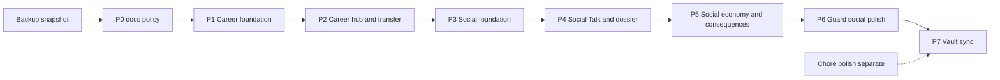

# Social & Career PR Slice Plan

**Status:** Active plan — slice the local uncommitted blob; then finish remaining Social gaps.
**Policy:** [[Small PRs & Feature Slices]]
**Specs:** [[Social Ecosystem & Gangs]] · [[Prison Career Ladder]] · [[World Saves & Start Screen]] · [[Facility Transfer & Graduation]]
**Branch context (7/16/2026):** `feat/social-ecosystem` tip = docs-only (`a8651b2`, already on `dev` via PR #41). A large **uncommitted** Career + Social + misc polish tree sits on the primary checkout.

## Locked decisions

1. **Do not rewrite** merged PR #41 / `dev` history.
2. **Do** split the uncommitted working tree into sequential small PRs off latest `origin/dev`.
3. Snapshot with `git stash create` → `refs/backup/pre-split-*` before moving files.
4. Primary checkout returns to **`dev`**; each slice gets its own worktree.
5. Playtest gate still applies per slice ([[Development Workflow]]).

---

## Phase 0 — Process (docs only)

| Field | Value |
|---|---|
| Branch | `docs/small-pr-policy` |
| Scope | [[Small PRs & Feature Slices]] + links in [[Development Workflow]] / [[Git & Branching]] / Cursor rules / Home / Devlog |
| Playtest | N/A |
| Depends on | Nothing |

*This note + policy are Phase 0 deliverables.*

---

## Phase 1 — Career foundation (M1–M2-ish)

| Field | Value |
|---|---|
| Branch | `feat/career-world-store` |
| Goal | Named worlds, facility catalog, session/seed — no full menu UX required yet |
| Include | `Assets/Scripts/Shared/Career/` **except** UI-heavy: keep `CareerMainMenuUI`, `CareerQuitConfirmUI`, `SentenceClockHUD`, `SceneTransitionScreen`, `CareerTransferFlow` for Phase 2 if needed for compile; prefer including pure data first |
| Must include for compile | `CareerWorld`, `CareerWorldStore`, `CareerSession`, `CareerSeed`, `FacilityIds`, `FacilityDefinition`, `FacilityCatalog`, `FacilityDirectory`, `FacilityRunState`, `CareerRespectMath`, `CareerTransfer` (math), `SentenceClockMath` |
| Assets | `Assets/Resources/Facilities/*.asset` (+ metas), `FacilityDefinitionInstaller.cs` |
| Tests | `CareerWorldStoreTests.cs`, `CareerTestRunner.cs` |
| Exclude | CountyJail scene, EscapeEndScreen rewrite, Social folder, scene polish |
| Note | `CareerSession.SyncGlobalsFromScene` Social gang-tag bridge **deferred to Phase 3** so this slice compiles without `Prison.Social`. |
| Verify | EditMode Career store tests green; no Social references required |
| Playtest | Create/load world via temporary menu hook **or** EditMode-only if no UI yet — prefer shipping Phase 1+2 together only if Phase 1 cannot boot without UI |

**If Career UI is required to compile GameManager:** fold minimal bootstrap into Phase 1 and keep ceremony UI in Phase 2.

---

## Phase 2 — Career hub, transfer, County clock

| Field | Value |
|---|---|
| Branch | `feat/career-hub-transfer` |
| Goal | MainMenu worlds + prison select, transfer ceremony, County sentence clock, CountyJail stub |
| Include | `CareerMainMenuUI`, `CareerQuitConfirmUI`, `CareerTransferFlow`, `SceneTransitionScreen`, `SentenceClockHUD`, `CareerRunBootstrap`; `EscapeEndScreenUI` / `PauseManager` / `EscapeManager` / `GameManager` **Career-only hunks**; `EditorBuildSettings`; `CountyJail.unity`; `CareerTransferTests` |
| Exclude | Social boot in GameManager (stub/no-op until Phase 3), Social scripts |
| Vault | Flip Career secondary notes (Roadmap, World Rules 27–33 header, Systems Overview) to match primary Implemented status |
| Playtest | New World → enter Dev Sandbox or County → Quit to Prison Select → transfer ceremony path if reachable |

---

## Phase 3 — Social foundation (M1)

| Field | Value |
|---|---|
| Branch | `feat/social-m1-foundation` |
| Goal | Replace v1 social runtime with Respect/Trust store, identity, memory, gangs core — **no Talk/Dossier UI yet** |
| Delete | `SocialManager`, `SocialMath`, `SocialActionType`, `FavorOfferDefinition`, `NPCPersonalityData`, `PrisonSocialRowUI`, `SocialMathTests` |
| Add (core) | `SocialTypes`, `RelationshipMath`, `RelationshipStore`, `SocialMemory`, `SocialNameGenerator`, `SocialRosterBuilder`, `ArchetypeDefinition`, `GangDefinition`, `GangManager`, `SocialWorld` (boot + seeding), `GossipSystem` (logic OK), `SocialActs`, `CrimeSignals`, `GuardSocialProfile` (data), `DialogueLibrary` (tables) |
| Wire | `GameManager.BuildSocialWorld` + Career arrival seed; `PrisonerSocialPresenter` **minimal** (no full menu — open stub or chat-only later) |
| Tests | `SocialRelationshipTests`, `SocialMemoryGossipTests`, `SocialRosterSnitchTests` (snitch math without full UI) |
| Tooling | `SocialAssetInstaller`, `SocialTestRunner`; run installer optionally to create `Resources/Social/` |
| Rebuild | `SocialBalanceSimulatorWindow` against v3 math |
| Exclude | `SocialInteractionMenu`, `SocialDossierUI`, `TradingService` UI path, full Favor runtime UI |
| Playtest | Enter play mode: NPCs get names/bands on labels if wired; no crash; EditMode green |

---

## Phase 4 — Talk Menu + Dossier (M2–M3 UI)

| Field | Value |
|---|---|
| Branch | `feat/social-talk-dossier` |
| Goal | Full Talk Menu + notebook Relationships/Gangs pages + nameplate bands + markers |
| Include | `SocialInteractionMenu`, `SocialDossierUI`, `StandingBandUI`, `SocialToastUI`; `StolenNotebookUI`, `AffinityFloatPopup`, `CharacterNameLabel`, `PrisonerSocialPresenter` full wire; `GangTerritoryMonitor` |
| Vault | Mark [[Talk Menu & NPC Profile]] + [[Social Dossier — Relationships & Gangs]] Implemented |
| Playtest | Tab → Relationships/Gangs; E/interact NPC → Profile/Talk/Gift; nameplate colors; territory warn-off bark |

---

## Phase 5 — Economy + consequences (M4–M5)

| Field | Value |
|---|---|
| Branch | `feat/social-economy-consequences` |
| Goal | Trade, bribes, wallet sinks/sources, two-way favors, gossip ticker, snitch → targeted shakedown, light job |
| Include | `TradingService`, `TradeMath`, `FavorService`, `SocialFavorRuntime`, `PrisonJobPaymaster`, `SnitchSystem`, `SocialSimulationTicker`; hooks in `MorningShakedownSweeper`, `GuardDetection`/`GuardFSM` as needed; `SocialGangTradeTests` |
| Playtest | Buy from Hustler; bribe Corrupt if known; accept favor `!`; get tipped/shaken; job payday |

---

## Phase 6 — Guard social polish (M6 remainder)

| Field | Value |
|---|---|
| Branch | `feat/social-guard-trust` |
| Goal | Close remaining gaps from sync report |
| Work | Per-player guard Trust → detection range / compliance grace; fame shakedown priority if not wired; balance pass in simulator; ambient argument polish |
| Playtest | High-trust Rookie vs low-trust Veteran feel different; tip clear bribe still works |

---

## Phase 7 — Vault truth pass (docs)

| Field | Value |
|---|---|
| Branch | `docs/social-career-status-sync` |
| Goal | Docs match merged code after Phases 1–6 |
| Include | Flip [[Social Ecosystem & Gangs]] to Implemented; rewrite [[Social & Reputation]]; Systems Overview / Roadmap / World Rules / Devlog / Prisoner AI / Guard AI / Loot & Economy |
| Playtest | N/A |

*May ship smaller docs syncs after each code phase instead of one big Phase 7 — preferred under [[Small PRs & Feature Slices]].*

---

## Separate chore PRs (do not mix)

Unrelated dirty tree items — **own PRs or leave uncommitted**:

| Slice | Examples |
|---|---|
| `chore/navmesh-cell-links` | `CellDoorNavMeshLink`, NavMesh asset delete/rebake, `NavMeshAreas` |
| `chore/waypoint-world-guide` | `WaypointWorldGuide` + ObjectiveWaypointUI hunks |
| `chore/character-visual-polish` | anim controllers, clothing mats, FBX meta, BlenderKit setup |
| `chore/collision-camera-fixer` | `PrisonCollisionAndCameraFixer` |
| `chore/scene-prefab-drift` | PrisonLevel1 / prefab noise only if intentional |
| Never commit | `TestResults-EditMode.log`, `UnityTestRun.log` unless you ask |

---

## Remaining implementation (after slices land)

Work that is **not** just "commit what exists" — real follow-through:

### A. Social completeness

| Item | Why |
|---|---|
| Run + commit `SocialAssetInstaller` output (`Resources/Social/Archetypes|Gangs`) | Designer-tunable SOs; code catalogs are fallback only |
| Guard trust → detection / compliance modifiers | Specced; BlindEye/Rookie/Veteran exist; trust scaling thin |
| Gift preference fog fully driven from Talk + dossier | Verify discovery path end-to-end |
| Initiation / Traitor flows playable | Shot-Caller offer → Member; betrayal lockout |
| Snitch discovery via Old-Timer Chat ≥ 50 | Spec locked; verify dialogue path |
| Economy: Coin → wallet; job pay rates tuned | M4 |
| Balance pass | Soft-cap, bribe prices, stock tables |

### B. Career completeness (M6+)

| Item | Why |
|---|---|
| Facility scenes beyond County stub | Content epic |
| Escape completion end screen = transfer ceremony polish | Specced rewrite |
| Soft Fed-tier gates | Career Ladder |
| Revisit / farm loop playtest across two facilities | Integration |

### C. Process hygiene

| Item | Why |
|---|---|
| Keep primary on `dev`; features in worktrees | [[Git & Branching]] |
| One milestone → one PR forever | This note + [[Small PRs & Feature Slices]] |
| Graphify refresh when CLI available | Workflow checklist |

---

## Suggested first three actions (when you say go)

1. Confirm Phase 0 docs are good (this file + policy — already written).
2. Snapshot dirty tree → `refs/backup/pre-split-*`.
3. Reset primary to `origin/dev`; open worktree for `feat/career-world-store` (Phase 1) and stage **only** Career foundation files from the backup.

Do **not** start Phase 1 until you explicitly ask to execute the split.

---

## Success criteria

- `dev` history shows readable, themed commits/PRs instead of one Social+Career megadump
- Each merged slice has a Devlog line and a playtest checklist
- Vault status matches code within one docs PR of the merge
- Remaining gaps listed above are tracked as future slices, not hidden WIP

Related: [[Small PRs & Feature Slices]] · [[Social Ecosystem & Gangs]] · [[Prison Career Ladder]] · [[Development Workflow]]
